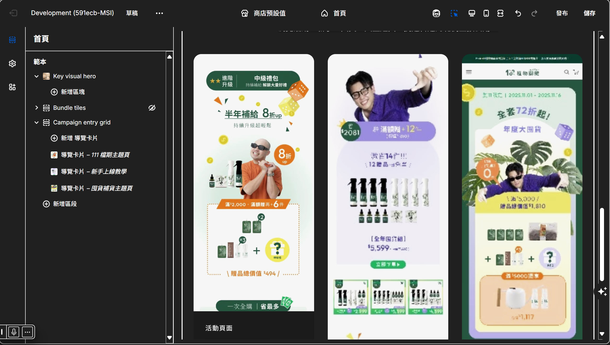
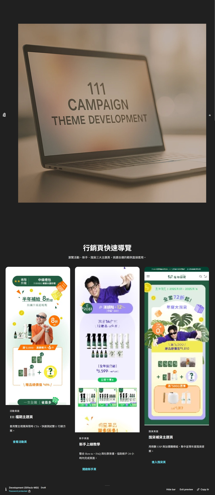

# Shopify 111 Campaign – 行銷頁主題（OS 2.0 / Shopify CLI 3.x）

以 **Shopify Online Store 2.0 + Sections/Blocks + Shopify CLI 3.x** 打造的「111 行銷活動主題」。  
支援 **桌機 1280×500 hero banner**、行動端 RWD、活動卡片格狀導覽、FAQ 手風琴、進場動畫（`IntersectionObserver` / `prefers-reduced-motion` 降級）等。

  

> 上圖為專案 hero banner（柔光、超現實感，**1280×500**，適合桌機首頁頂部）。  
> 若要另外展示編輯器或頁面預覽，可在下方加入你的第二張圖：

  

---

## ✨ 特色 Highlights

- **OS 2.0 模組化架構**：`templates/*.json` + `sections/*` + `snippets/*`，可在 Theme Editor 自由拖拉配置。  
- **RWD 與效能**：桌機/行動自適應；圖片使用 `image_url | image_tag` 產生 `srcset`，首屏可加 `fetchpriority="high"`。  
- **互動與可及性**：  
  - `IntersectionObserver` 進場動畫，搭配 `prefers-reduced-motion` 自動降級；  
  - FAQ 採 WAI-ARIA 標記（`button[aria-controls]` / `aria-expanded` + `role="region"`）。  
- **開發者體驗**：  
  - **Shopify CLI 3.x** 一鍵 `theme dev` 熱更新；  
  - `shopify theme check` 靜態檢查；  
  - `run-shopify-tasks.ps1`(Windows PS7) 與 `.vscode/tasks.json`（可選）幫你在 VS Code 直接跑 Dev/Check/Push。

> 參考：  
> - Shopify CLI 主題命令（`theme dev / push / share / check`）【[官方文件]】  
>   - `theme dev` 會回傳 **http://127.0.0.1:9292** 以 **熱更新 CSS / sections**，並提供開發主題與預覽連結【[docs]】。  
> - Theme Access：以 7 天有效的 **Theme Access 密碼**安全授權 CLI 操作主題【[docs]】。  
> - Theme Check：`shopify theme check` / `.theme-check.yml` 設定與 CI 集成【[docs]】。  
> - Theme Architecture（Layout/Template/Section/Snippet/Assets/Config/Locales）【[docs]】【[help]】。

[官方文件 – Shopify CLI Theme commands]: https://shopify.dev/docs/api/shopify-cli/theme  
[docs]: https://shopify.dev/docs/api/shopify-cli/theme/theme-dev  
[Theme Access]: https://shopify.dev/docs/storefronts/themes/tools/theme-access  
[Theme Access App]: https://apps.shopify.com/theme-access  
[Theme Check docs]: https://shopify.dev/docs/storefronts/themes/tools/theme-check/commands  
[Theme Check config]: https://shopify.dev/docs/storefronts/themes/tools/theme-check/configuration  
[Theme Architecture docs]: https://shopify.dev/docs/storefronts/themes/architecture  
[help]: https://help.shopify.com/en/manual/online-store/themes/theme-structure

---

## 🗂 專案結構（精簡）
